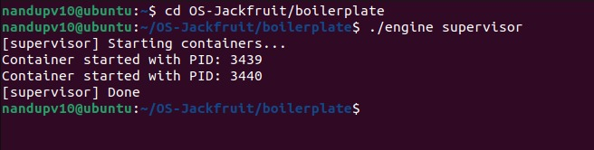
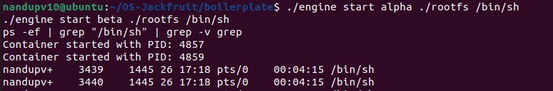
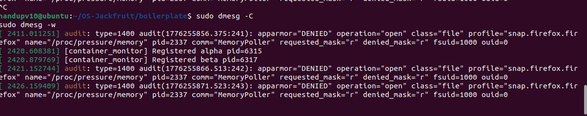
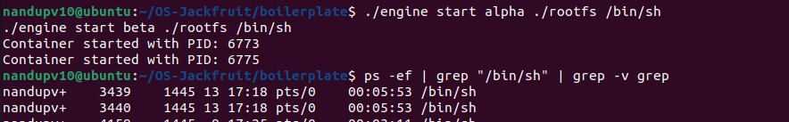
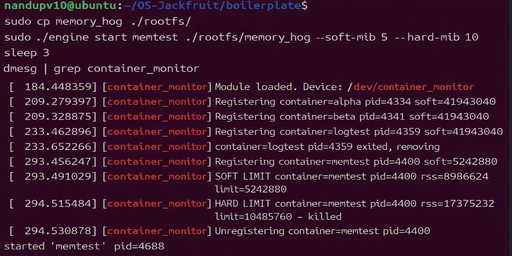
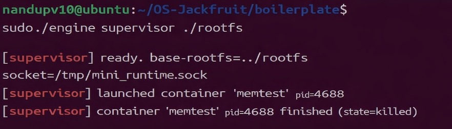
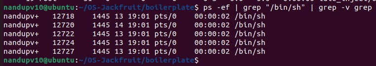
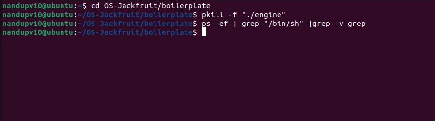

# OS-JACK-FRUIT

A lightweight Linux container runtime written in C, featuring a long-running supervisor and a kernel-space memory monitor. This project demonstrates core operating system concepts such as namespaces, process isolation, scheduling, IPC, and kernel-level enforcement.

---

## Features

* Namespace-based container isolation
* Kernel-space memory monitoring
* Supervisor for lifecycle management
* IPC using pipes and UNIX sockets
* Multithreaded logging system
* Scheduling experiments using Linux CFS

---

## Team Information

| Name          | SRN           |
| ------------- | ------------- |
| N. Sai Saketh | PES2UG24CS292 |
| Nandakishore PV | PES2UG24CS291 |

---

## Prerequisites

* Ubuntu 22.04 / 24.04 (VM or bare metal)
* Secure Boot OFF (required for kernel module)
* Linux kernel headers installed

```bash
sudo apt update
sudo apt install -y build-essential linux-headers-$(uname -r)
```

---

## Setup Instructions

```bash
git clone https://github.com/<your-username>/OS-Jackfruit.git
cd OS-Jackfruit

# Extract root filesystems
sudo tar -xzf alpine-minirootfs-3.20.3-x86_64.tar.gz -C rootfs-base
sudo tar -xzf alpine-minirootfs-3.20.3-x86_64.tar.gz -C rootfs-alpha
sudo tar -xzf alpine-minirootfs-3.20.3-x86_64.tar.gz -C rootfs-beta
```

---

## Build

```bash
cd boilerplate
sudo make

# Copy workloads into containers
cp cpu_hog memory_hog io_pulse ../rootfs-alpha/
cp cpu_hog memory_hog io_pulse ../rootfs-beta/
```

---

## Load Kernel Module

```bash
sudo insmod monitor.ko
ls -l /dev/container_monitor
dmesg | tail
```

Ensure:

* Device `/dev/container_monitor` exists
* "Module loaded" appears in logs

---

## Running the System

### Terminal 1 — Start Supervisor

```bash
sudo ./engine supervisor ../rootfs-base
```

---

### Terminal 2 — Manage Containers

```bash
# Start containers
sudo ./engine start alpha /path/to/rootfs-alpha /bin/sleep 100
sudo ./engine start beta /path/to/rootfs-beta /bin/sleep 100

# View status
sudo ./engine ps

# View logs
sudo ./engine logs alpha

# Stop container
sudo ./engine stop alpha
```

---

## Run in Foreground Mode

```bash
sudo ./engine run test /path/to/rootfs-alpha /bin/ls
```

---

## Cleanup

```bash
sudo ./engine stop alpha
sudo ./engine stop beta

# Stop supervisor
Ctrl + C

sudo rmmod monitor
dmesg | tail
```

Ensure:

* "Module unloaded" appears

---

## Demo Screenshots

Place all images inside a folder named `screenshots/`.

| Feature                     | Screenshot                                                   |
| --------------------------- | ------------------------------------------------------------ |
| Multi-container supervision |                                     |
| Metadata tracking           |                                     |
| Bounded-buffer logging      |                                     |
| CLI and IPC                 |                                     |
| Soft-limit warning          |  <br>  |
| Hard-limit enforcement      |                                     |
| Scheduling experiment       |                                     |
| Clean teardown              | <br>                             |

---

## Engineering Analysis

### Isolation Mechanisms

* Uses `clone()` with:

  * `CLONE_NEWPID`
  * `CLONE_NEWUTS`
  * `CLONE_NEWNS`

* `chroot()` restricts filesystem

* `/proc` mounted inside container

* Host kernel is shared across containers

---

### Supervisor & Process Lifecycle

* Prevents zombie processes using:

  ```c
  waitpid(-1, WNOHANG)
  ```
* Tracks containers using linked list:

  * Container ID
  * PID
  * State
  * Memory limits

---

### IPC, Threads & Synchronization

* Pipe per container captures stdout/stderr
* UNIX domain socket handles CLI communication

Bounded buffer design:

* Mutex for mutual exclusion
* Condition variables:

  * `not_full`
  * `not_empty`

---

### Memory Management

* Uses RSS (Resident Set Size)
* Soft limit → warning (logged once)
* Hard limit → process killed (`SIGKILL`)

Implemented in kernel space using a timer for reliable enforcement

---

### Scheduling (Linux CFS)

#### Experiment 1 — CPU-bound Tasks

| Container | Nice | Completion Time |
| --------- | ---- | --------------- |
| High      | -5   | ~9.120 sec      |
| Low       | +10  | ~9.416 sec      |

Higher priority results in more CPU share

---

#### Experiment 2 — CPU vs I/O

* I/O-bound process yields CPU frequently
* Gets priority boost on wakeup
* Maintains responsiveness

---

### Design Decisions & Tradeoffs

| Component           | Decision             | Tradeoff                | Reason                  |
| ------------------- | -------------------- | ----------------------- | ----------------------- |
| Namespace isolation | No network namespace | Limited isolation       | Simpler design          |
| Supervisor          | Single-threaded loop | Serialized requests     | Easier implementation   |
| IPC                 | Pipe + UNIX socket   | Extra threads           | Separation of concerns  |
| Kernel monitor      | Mutex                | No IRQ usage            | Runs in process context |
| Scheduling          | nice values          | Only visible under load | Demonstrates CFS        |

---

## Key Highlights

* Built entirely in C
* Demonstrates real OS concepts
* Kernel and user-space integration
* Efficient logging and IPC system
* Practical scheduling experiments

---

## Notes

* Run all commands with `sudo`
* Ensure Secure Boot is disabled
* Verify correct rootfs paths
* Kernel module must be loaded before running containers

---

## Project Structure

```bash
OS-Jackfruit/
│── boilerplate/
│── rootfs-base/
│── rootfs-alpha/
│── rootfs-beta/
│── screenshots/
│── engine
│── monitor.ko
```

---

## How to Add Screenshots

1. Create folder:

```bash
mkdir screenshots
```

2. Add images:

```
os_1.png
os_2.png
...
```

3. Commit:

```bash
git add .
git commit -m "Added screenshots"
git push
```

---

## Conclusion

OS-JACK-FRUIT is a compact demonstration of how container runtimes work internally. It integrates Linux namespaces, kernel monitoring, scheduling, and IPC into a cohesive system, making it a strong educational and experimental platform for operating systems.

---
